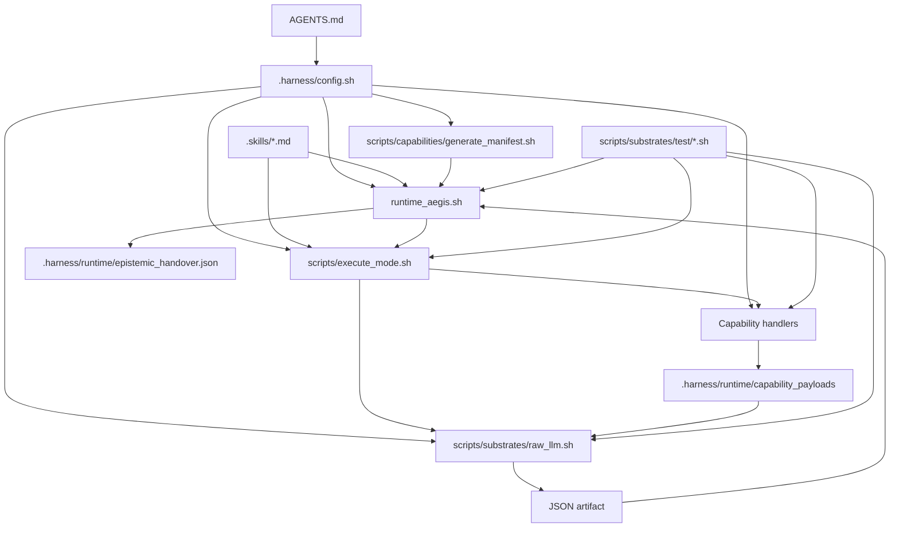

# Aegis Harness Summary

## Purpose of This Document

This file is a descriptive map of the repository as it exists in the current workspace.

It answers three practical questions:

1. Which files exist and what does each one do?
2. How do those files relate during execution?
3. Which declared parts of the architecture are present, generated, missing, or stale?

This document is not constitutional. If it conflicts with the authoritative contract, precedence is:

1. `AGENTS.md`
2. `.harness/config.sh`
3. runtime-generated manifests and capability contracts
4. mode contracts under `.skills/`
5. transient runtime artifacts under `.harness/runtime/`
6. the rest of the repository

## One-Sentence System Summary

Aegis Harness is a runtime-sovereign execution harness that exposes bounded capability evidence to mode contracts, routes execution through a protocol VM, and promotes only validated JSON artifacts back into runtime-owned handover state.

## High-Level Execution Graph



## Why These Files Exist

The repository is intentionally split so that authority, wiring, execution, evidence, and verification do not collapse into one script.

### 1. Governance stays separate from execution

`AGENTS.md`, `.harness/00_architecture_core.md`, and `.skills/*.md` exist so the meaning of the system is declared outside the runtime entrypoints.

That separation matters because `runtime_aegis.sh` and `scripts/execute_mode.sh` can change implementation details without silently redefining constitutional rules, mode semantics, or allowed evidence behavior.

### 2. One file owns topology, not business logic spread across scripts

`.harness/config.sh` exists to centralize mode registration, capability handlers, evidence profiles, provider defaults, and runtime paths.

The practical justification is containment: the executor, manifest generator, substrate, and tests all read the same wiring source instead of duplicating configuration in multiple places.

### 3. Runtime orchestration and mode execution are split on purpose

`runtime_aegis.sh` exists to own lifecycle concerns such as environment checks, handover reset or promotion, runtime directory preparation, and final cleanup.

`scripts/execute_mode.sh` exists separately because capability materialization and substrate invocation are a smaller protocol-execution concern. Keeping those roles apart reduces the chance that mode execution logic quietly takes ownership of runtime policy.

### 4. Capability handlers are individual files so authority remains inspectable

Files under `scripts/capabilities/` are separate handlers rather than shell branches inside one monolith.

The justification is auditability: each capability has a named surface, a concrete implementation, and a clear registration point in `.harness/config.sh`, which makes manifests and tests easier to align with the actual authority surface.

### 5. The test suite mirrors architectural promises

The shell tests under `scripts/substrates/test/` exist because most of the important guarantees in this repository are runtime contracts, not just library-level functions.

They verify that the constitutional model, capability exposure rules, handover semantics, and readonly execution path still match what the repository claims.

### 6. The TypeScript tree is structural support, not the main runtime

The `src/` files currently exist mostly to keep TypeScript, ESLint, and boundaries rules anchored to a minimal source surface.

That is why they look thinner than the shell runtime: today they support tooling discipline more than product behavior.

## Repository Tree Snapshot

The following tree is a compact snapshot of the current workspace structure.

It is included to make the repository shape visible at a glance before the per-file explanation below.

```text
.
├── .harness/
│   ├── 00_architecture_core.md
│   ├── config.sh
│   ├── enforcement/
│   │   └── ast_grep_rules.yml
│   └── runtime/
│       └── epistemic_handover.json
├── .skills/
│   ├── adversarial.md
│   ├── discovery.md
│   ├── forensics.md
│   ├── optimize.md
│   ├── repair.md
│   └── validation.md
├── AGENTS.md
├── LICENSE.md
├── README.md
├── aider.conf.yml
├── eslint.config.js
├── package-lock.json
├── package.json
├── runtime_aegis.sh
├── scripts/
│   ├── capabilities/
│   │   ├── filesystem/
│   │   │   ├── list_tree.sh
│   │   │   ├── read_file.sh
│   │   │   └── search_symbol.sh
│   │   ├── generate_manifest.sh
│   │   ├── git/
│   │   │   ├── git_diff.sh
│   │   │   └── git_status.sh
│   │   └── runtime/
│   ├── execute_mode.sh
│   ├── substrates/
│   │   ├── raw_llm.sh
│   │   └── test/
│   │       ├── test_capabilities.sh
│   │       ├── test_constitutional_invariants.sh
│   │       ├── test_forensics_behavior.sh
│   │       ├── test_readonly_modes.sh
│   │       └── test_runtime_contract.sh
│   └── test_environment.sh
├── src/
│   ├── index.ts
│   └── ui/
│       ├── fake_import.ts
│       └── index.ts
├── summary.md
└── tsconfig.json
```

Directories intentionally excluded from the tree above: `.git/` and `node_modules/`, because they are repository metadata or installed dependencies rather than project source.

## Repository Structure by File

Observed runtime-generated file in workspace: 1

Directories such as `.git/` and `node_modules/` are intentionally excluded from the logical map below because they are repository metadata or installed dependencies rather than project source.

### Root Files

| Path | Function inside the project | Relationship to other files |
| --- | --- | --- |
| `AGENTS.md` | Constitutional foundation of Aegis. Defines authority boundaries, memory model, mode semantics, and precedence. It exists so the runtime never becomes the implicit source of truth. | Governs the meaning of `.harness/config.sh`, `runtime_aegis.sh`, `scripts/execute_mode.sh`, `.skills/*.md`, and the overall wording of `README.md` and this file. |
| `README.md` | Public architecture and usage overview. Explains runtime, capabilities, modes, and common commands. It exists for operator orientation rather than normative control. | Summarizes the structure defined by `AGENTS.md`, `.harness/config.sh`, `runtime_aegis.sh`, `scripts/execute_mode.sh`, and the scripts under `scripts/`. |
| `summary.md` | This repository map. Documents observed structure, file roles, current cross-file relationships, and known structural mismatches. | Secondary to `AGENTS.md` and `.harness/config.sh`; should stay aligned with `README.md`, runtime files, and the actual tree. |
| `package.json` | Node package manifest for local tooling. Declares lint, typecheck, enforcement, and shell-based test scripts. It exists to make structural verification reproducible from one entrypoint. | Invokes `runtime_aegis.sh`, `scripts/test_environment.sh`, and the test harnesses under `scripts/substrates/test/`. Depends on `eslint.config.js` and `tsconfig.json` for JS/TS validation. |
| `package-lock.json` | NPM lockfile that pins exact dev dependency versions. | Freezes the toolchain used by `package.json`, especially TypeScript, ESLint, and ast-grep. |
| `tsconfig.json` | TypeScript compiler policy for the small `src/` tree. It exists because the repository still wants typed structural discipline even though the main runtime is shell-based. | Used by `package.json` typecheck scripts and by `eslint.config.js` parser options. Covers `src/` and `.harness/`. |
| `eslint.config.js` | ESLint flat config with structural dependency rules via `eslint-plugin-boundaries`. It exists to encode layering assumptions mechanically rather than leaving them as prose. | Enforces layering over `src/**/*.ts`; complements `tsconfig.json` and the scripts in `package.json`. |
| `.gitignore` | Ignore policy for runtime residue, execution surfaces, aider artifacts, transient logs, and dependencies. | Describes which files created by `runtime_aegis.sh`, `scripts/execute_mode.sh`, and external tooling should not be committed. |
| `runtime_aegis.sh` | Sovereign runtime orchestrator. Validates environment, prepares runtime surfaces, resets or promotes handover, delegates mode execution, and cleans up. It exists to keep lifecycle authority in one place. | Loads `.harness/config.sh`, selects `.skills/<mode>.md`, generates manifests via `scripts/capabilities/generate_manifest.sh`, delegates to `scripts/execute_mode.sh`, and writes `.harness/runtime/epistemic_handover.json`. |
| `aider.conf.yml` | Human interactive profile for aider-based local workflows. It exists as a future-facing mutation support file, separate from the readonly raw substrate path. | Intended to support mutation modes configured in `.harness/config.sh`; separate from the raw readonly substrate path. |
| `LICENSE.md` | Repository license file. | Legal metadata only; not part of execution flow. |

### Harness Configuration and Governance

| Path | Function inside the project | Relationship to other files |
| --- | --- | --- |
| `.harness/config.sh` | Operational topology source of truth. Declares runtime directories, budgets, provider defaults, execution engines, capability maps, handler registry, and evidence profiles. | Loaded by `runtime_aegis.sh`, `scripts/execute_mode.sh`, `scripts/capabilities/generate_manifest.sh`, `scripts/substrates/raw_llm.sh`, and the shell tests. It is the central wiring file of the repository. |
| `.harness/00_architecture_core.md` | Supplemental architecture doctrine explaining structural truth, cognition layering, and runtime separation. | Supports the constitutional model from `AGENTS.md` and informs the language used by `README.md` and the mode contracts. |
| `.harness/enforcement/ast_grep_rules.yml` | Mechanical enforcement rules for structural containment. | Used by the `aegis:enforce` script in `package.json` to add automated checks alongside ESLint and TypeScript. |
| `.harness/runtime/epistemic_handover.json` | Current runtime-owned transient continuity artifact in the workspace. Stores `artifact_snapshot` and minimal `epistemic_state`. | Read and normalized by `runtime_aegis.sh`; exposed to modes through runtime-selected `filesystem.read` payloads; expected by readonly mode tests. It is ignored by git but operationally central. |

### Mode Contracts

| Path | Function inside the project | Relationship to other files |
| --- | --- | --- |
| `.skills/discovery.md` | Contract for bounded observation mode. Requires direct evidence-backed observations and a `handover_attention` object. | Selected by `runtime_aegis.sh` when mode is `discovery`; consumed by `scripts/substrates/raw_llm.sh` as prompt context. Expectations are exercised by readonly mode tests. |
| `.skills/forensics.md` | Contract for bounded interpretation mode. Requires evidence-backed interpretations and narrowed handover attention. | Selected by `runtime_aegis.sh` for `forensics`; consumed by the raw substrate; behavior is targeted by `scripts/substrates/test/test_forensics_behavior.sh`. |
| `.skills/validation.md` | Contract for bounded verdict mode. Limits validation to exposed evidence and prohibits rediscovery. | Selected by `runtime_aegis.sh` for `validation`; paired with the readonly evidence profile from `.harness/config.sh`. |
| `.skills/adversarial.md` | Contract for bounded falsification mode. Challenges current results using observable evidence only. | Selected by `runtime_aegis.sh` for `adversarial`; receives readonly evidence chosen by `scripts/execute_mode.sh`. |
| `.skills/repair.md` | Contract for bounded mutation mode focused on corrective changes. | Declared in `.harness/config.sh` as an `aider` engine mode. The runtime can route to it, but `scripts/execute_mode.sh` currently terminates with `mutation_substrate_not_implemented` for `aider`. |
| `.skills/optimize.md` | Contract for bounded mutation mode focused on simplification. | Also configured as an `aider` engine mode in `.harness/config.sh` and currently blocked by the unimplemented mutation substrate path in `scripts/execute_mode.sh`. |

### Runtime, Executor, and Capability Scripts

| Path | Function inside the project | Relationship to other files |
| --- | --- | --- |
| `scripts/execute_mode.sh` | Protocol VM. Resolves execution engine, capability envelope, evidence profile, capability arguments, payload generation, selected manifest, substrate call, and artifact validation. | Called by `runtime_aegis.sh`; loads `.harness/config.sh`; materializes wrappers for handlers under `scripts/capabilities/`; calls `scripts/substrates/raw_llm.sh` for readonly modes. |
| `scripts/test_environment.sh` | Local environment smoke checker for Node, npm, TypeScript, ESLint, ast-grep, Python, and Git. | Supports manual setup and complements the dev-tool scripts in `package.json`. |
| `scripts/capabilities/generate_manifest.sh` | Deterministic manifest generator for all modes, engines, envelopes, handler provenance, and evidence profiles. | Loads `.harness/config.sh`; is invoked by `runtime_aegis.sh`; its output is consumed and sliced per mode by `scripts/execute_mode.sh`. |
| `scripts/capabilities/filesystem/list_tree.sh` | Readonly capability that emits a pruned, deterministic repository tree as JSON evidence. | Registered in `.harness/config.sh`; wrapped by `scripts/execute_mode.sh`; primarily used in discovery evidence profiles and validated by `test_capabilities.sh`. |
| `scripts/capabilities/filesystem/read_file.sh` | Readonly capability that emits bounded file contents as JSON evidence. | Registered in `.harness/config.sh`; exposed in capability envelopes; validated by `test_capabilities.sh`; useful for direct file evidence rather than full tree exposure. |
| `scripts/capabilities/filesystem/search_symbol.sh` | Readonly capability that performs bounded grep-style symbol search with context and payload-size limits. | Registered in `.harness/config.sh`; heavily used across discovery, forensics, adversarial, repair, and optimize evidence profiles. |
| `scripts/capabilities/git/git_status.sh` | Readonly capability that emits `git status --short` as JSON evidence. | Registered in `.harness/config.sh`; used by forensics, repair, and optimize evidence profiles. |
| `scripts/capabilities/git/git_diff.sh` | Readonly capability that emits the current uncommitted diff as JSON evidence. | Registered in `.harness/config.sh`; exposed only in mutation envelopes and related evidence profiles. |
| `scripts/substrates/raw_llm.sh` | Readonly cognition substrate. Builds bounded prompt context from the selected skill, selected manifest, and selected payloads; then calls the provider and extracts one JSON artifact between markers. | Invoked by `scripts/execute_mode.sh` for `raw` modes; depends on `.harness/config.sh`, `.skills/*.md`, provider env vars, and the payloads created by capability scripts. |

### Shell Test Harnesses

| Path | Function inside the project | Relationship to other files |
| --- | --- | --- |
| `scripts/substrates/test/test_capabilities.sh` | Direct capability harness. Creates temporary runtime context and validates successful JSON contracts for capability scripts. | Exercises filesystem and git capabilities against `.harness/config.sh`, including runtime-owned files read through `filesystem.read`. |
| `scripts/substrates/test/test_runtime_contract.sh` | Runtime-owned filesystem exposure contract test. Verifies that runtime-owned files are surfaced through `filesystem.read` and that specialized runtime read handlers are gone. | Checks manifest/config consolidation and validates reads of the epistemic handover through generic file reading. |
| `scripts/substrates/test/test_readonly_modes.sh` | Readonly runtime smoke suite. Starts a mock provider, runs readonly modes, and checks manifests, payload sets, default investigation input, and execution-surface behavior. | Exercises `runtime_aegis.sh`, `scripts/capabilities/generate_manifest.sh`, `scripts/execute_mode.sh`, `scripts/substrates/raw_llm.sh`, `.skills/discovery.md`, `.skills/forensics.md`, `.skills/validation.md`, and `.skills/adversarial.md`. |
| `scripts/substrates/test/test_constitutional_invariants.sh` | Constitutional invariant suite. Checks state registries, subprocess isolation, raw substrate isolation, investigation input continuity, and mode semantics. | Cross-checks `AGENTS.md` concepts against `.harness/config.sh`, `runtime_aegis.sh`, `scripts/execute_mode.sh`, and `scripts/substrates/raw_llm.sh`. |
| `scripts/substrates/test/test_forensics_behavior.sh` | Focused behavior test for discovery-to-forensics continuity and handover reset/promotion. | Runs `runtime_aegis.sh` with a mock provider and validates how `.harness/runtime/epistemic_handover.json` evolves between modes. |

### TypeScript Surface

| Path | Function inside the project | Relationship to other files |
| --- | --- | --- |
| `src/index.ts` | Empty TypeScript entry placeholder. Exists mainly to keep the TS toolchain anchored to a minimal source tree. | Included by `tsconfig.json` and linted by `eslint.config.js`; currently has no runtime relationship to the shell harness. |
| `src/ui/index.ts` | Placeholder UI module with a comment only. | Serves as a minimal target for the ESLint boundaries rules that define a `ui` layer in `eslint.config.js`. |
| `src/ui/fake_import.ts` | Minimal exported function used to keep the UI layer non-empty. | Exists so the `src/ui/` area contains executable TS content covered by `tsconfig.json` and ESLint rules. |

## How the Main Files Work Together

### 1. Governance and topology

`AGENTS.md` defines the constitutional meaning of the system.

`.harness/config.sh` turns that meaning into operational topology: paths, modes, engines, handler registry, evidence profiles, and limits.

Everything executable in the shell path takes its wiring from `.harness/config.sh`.

### 2. Runtime-owned execution

`runtime_aegis.sh` is the top-level orchestrator.

It validates the environment, prepares or resets `.harness/runtime/epistemic_handover.json`, creates runtime-owned capability directories, generates the manifest via `scripts/capabilities/generate_manifest.sh`, and delegates mode execution to `scripts/execute_mode.sh`.

After the substrate returns an artifact, the runtime validates it and promotes the artifact snapshot plus routed attention back into the handover file.

### 3. Capability evidence path

`scripts/execute_mode.sh` resolves the active capability envelope and evidence profile from `.harness/config.sh`.

It materializes wrapper executables in `.harness/runtime/capability_env/`, invokes the selected handlers under `scripts/capabilities/`, stores their JSON outputs in `.harness/runtime/capability_payloads/`, and builds a mode-specific manifest slice for the substrate.

### 4. Readonly cognition path

For readonly modes, `scripts/substrates/raw_llm.sh` receives four inputs:

1. the active model id
2. the active skill file from `.skills/`
3. the selected manifest JSON
4. the capability payload directory

It then constructs a bounded prompt using the investigation input, the skill contract, the selected manifest, and the selected payloads, calls the provider, and extracts exactly one JSON artifact between Aegis markers.

### 5. Test coverage path

The shell tests under `scripts/substrates/test/` are the executable checks that connect the design docs to the runtime.

They verify capability contracts, readonly mode behavior, runtime-bound context semantics, constitutional invariants, and discovery/forensics handover continuity.

### 6. Why the file layout matters operationally

The current layout is doing more than organizing files by topic.

It encodes the intended control boundary of the system:

1. top-level documents define meaning and operator-facing orientation
2. `.harness/` defines wiring and enforcement policy
3. `runtime_aegis.sh` owns lifecycle transitions
4. `scripts/execute_mode.sh` owns capability and substrate execution
5. `scripts/capabilities/` owns concrete authority surfaces
6. `scripts/substrates/` owns model-facing execution mechanics
7. `scripts/substrates/test/` checks that the above separation still holds

That structure is justified because the repository is trying to make authority boundaries inspectable from the tree itself, not only from comments.

## Observed Structural Gaps and Stale References

The current workspace reveals several mismatches between declared topology and present files:

1. The previous version of this summary referenced `scripts/lib/epistemic_handover.sh`, but that file is also not present in the repository tree; the current runtime keeps handover schema logic inline inside `runtime_aegis.sh`.
2. Mutation modes are declared in `.skills/repair.md` and `.skills/optimize.md` and mapped to the `aider` execution engine in `.harness/config.sh`, but `scripts/execute_mode.sh` still stops with `mutation_substrate_not_implemented` for that engine.
3. `package.json` still declares `aegis:bootstrap` as `bash scripts/bootstrap_aegis.sh`, but `scripts/bootstrap_aegis.sh` is not present in the current tree.
4. `package.json` points `aegis:test:capabilities`, `aegis:test:runtime-contract`, `aegis:test:readonly-modes`, and `aegis:test:constitutional-invariants` to `scripts/test_*.sh`, while the actual files live under `scripts/substrates/test/`.

These gaps matter because some declared contracts still cannot be executed end-to-end without implementing the mutation substrate path.

## Current Practical State

The repository is strongest today in the readonly runtime path:

- constitutional governance is explicit
- operational wiring is centralized
- readonly capability generation is implemented
- readonly raw substrate execution is implemented
- readonly mode tests are present and detailed

The repository is incomplete today in one execution-critical place:

- mutation-mode substrate execution is declared but not implemented in the executor

That means the current codebase behaves more like a hardened readonly evidence-and-promotion runtime than a fully complete multi-engine harness.